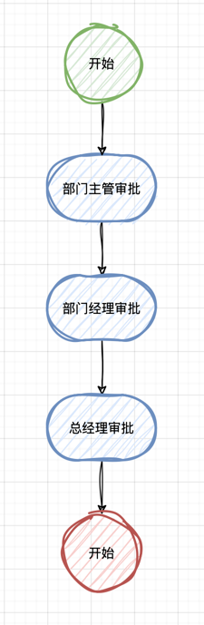
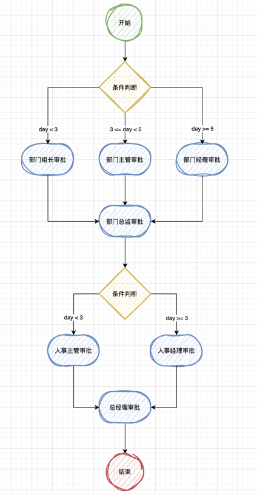

# 流程创建案例
## 1. 标准审批流程
### 1.1 流程定义
> 流程定义中:
> - tenantId: 租户 ID
> - key: 当前流程唯一标识
> - name: 流程名称
> - allowRedo: 是否允许撤回审批（当下个节点还未发生审批时，允许撤回），默认 true
> - requiredComment: 是否强制需要填写审批意见，默认 false
> - type: 流程类型
```java
WorkflowHelper workflowHelper = new WorkflowHelper(workflowEngine);
// 一、创建流程定义
DeploymentServiceHelper deploymentServiceHelper = workflowHelper.getDeploymentServiceHelper();
WorkflowDefinitionBuilder builder = WorkflowDefinitionBuilder.builder()
        .tenantId(tenantId)
        .key(workflowKey)
        .name("请假流程")
        .allowRedo(true)
        .requiredComment(true)
        .type("日常办公流程");
WorkflowDefinition workflowDefinition = deploymentServiceHelper.deploy(builder);
```
### 1.2 节点定义

```java
WorkflowServiceHelper workflowServiceHelper = workflowHelper.getWorkflowServiceHelper();
NodeDefinitionBuilder nodeDefinitionBuilder = NodeDefinitionBuilder.builderStartNode(tenantId, workflowDefinition.getId())
        .name("请假流程开始")
        .desc("开始节点");
NodeDefinition nodeDefinition = workflowServiceHelper.createStartNode(nodeDefinitionBuilder);

nodeDefinitionBuilder = NodeDefinitionBuilder.builderTaskNode(tenantId, workflowDefinition.getId(), 1)
        .name("部门主管审批")
        .desc("任务节点")
        .approveType(ApproveType.ALL)
        .approver(Approver.of("张三", "张三姓名", "张三备注"))
        .approver(Approver.of("李四", "李四姓名", "李四备注"));
nodeDefinition = workflowServiceHelper.createTaskNode(nodeDefinitionBuilder);

nodeDefinitionBuilder = NodeDefinitionBuilder.builderTaskNode(tenantId, workflowDefinition.getId(), 2)
        .name("部门经理审批")
        .desc("任务节点")
        .approver(Approver.of("王五", "王五姓名"));
nodeDefinition = workflowServiceHelper.createTaskNode(nodeDefinitionBuilder);

nodeDefinitionBuilder = NodeDefinitionBuilder.builderTaskNode(tenantId, workflowDefinition.getId(), 3)
        .name("总经理审批")
        .desc("任务节点")
        .approver(Approver.of("赵六", "赵六姓名"));
nodeDefinition = workflowServiceHelper.createTaskNode(nodeDefinitionBuilder);

nodeDefinitionBuilder = NodeDefinitionBuilder.builderEndNode(tenantId, workflowDefinition.getId())
        .name("请假流程结束")
        .desc("结束节点");
nodeDefinition = workflowServiceHelper.createEndNode(nodeDefinitionBuilder);
```
## 2. 条件审批流程
> 条件审批流程：表示提交审批时，自带审批条件，后续审批节点会根据该条件判断具体审批的节点  
> 例如：张三提交申请是，指定请假天数位 3 天，则根据条件会由**部门主管**审批，而不是**部门组长**审批或**部门总监**审批进行审批
### 2.1 流程定义
> 流程定义中: `conditionNotMatchedAnyStrategy`表示如果没人任何条件匹配时，将采取的策略
> - ConditionNotMatchedAnyStrategy.PROCESS_APPROVED: 流程直接同意，表示剩下的节点也不会执行，最终流程状态为通过
> - ConditionNotMatchedAnyStrategy.PROCESS_REJECTED: 流程直接拒绝，表示剩下的节点不会执行，最终流程状态为拒绝
> - ConditionNotMatchedAnyStrategy.PROCESS_CONTINUE_TO_NEXT: 流程跳转到下一个节点，表示会跳过不符合条件的节点，直到寻找到符合条件的节点
> - ConditionNotMatchedAnyStrategy.PROCESS_THROW_EXCEPTION: 直接抛出异常
```java
WorkflowHelper workflowHelper = new WorkflowHelper(workflowEngine);
// 一、创建流程定义
DeploymentServiceHelper deploymentServiceHelper = workflowHelper.getDeploymentServiceHelper();
WorkflowDefinitionBuilder builder = WorkflowDefinitionBuilder.builder()
        .tenantId(tenantId)
        .key(workflowKey)
        // 没有条件节点符合时的处理策略
        .conditionNotMatchedAnyStrategy(ConditionNotMatchedAnyStrategy.PROCESS_CONTINUE_TO_NEXT)
        .name("请假流程")
        .type("日常办公流程");
WorkflowDefinition workflowDefinition = deploymentServiceHelper.deploy(builder);
```
### 2.2 节点定义

```java
WorkflowService workflowService = workflowEngine.getWorkflowService();
NodeDefinition nodeDefinition = NodeDefinitionBuilder.builderStartNode(tenantId, workflowDefinition.getId())
        .name("请假流程开始").desc("开始节点").build();
nodeDefinition = workflowService.createNode(nodeDefinition);

Conditions conditions = Conditions.newInstance(LogicOperator.AND, 1);
conditions.addCondition(Condition.of("day", "1", Operator.GREATER_THAN_AND_EQUAL, "请假日期大于 1 天"));
conditions.addCondition(Condition.of("day", "3", Operator.LESS_THAN, "请假日期小于 3 天"));
nodeDefinition = NodeDefinitionBuilder.builderTaskNode(tenantId, workflowDefinition.getId(), 1)
        .name("部门组长审批").desc("任务节点").conditions(conditions).approveType(ApproveType.ANY)
        .approverId("张三")
        .build();
nodeDefinition = workflowService.createNode(nodeDefinition);

conditions = Conditions.newInstance(LogicOperator.AND, 2);
conditions.addCondition(Condition.of("day", "3", Operator.GREATER_THAN_AND_EQUAL, "请假日期大于等于 3 天"));
conditions.addCondition(Condition.of("day", "5", Operator.LESS_THAN, "请假日期小于 5 天"));
nodeDefinition = NodeDefinitionBuilder.builderTaskNode(tenantId, workflowDefinition.getId(), 1)
        .name("部门主管审批").desc("任务节点").conditions(conditions)
        .approverId("李四")
        .build();
nodeDefinition = workflowService.createNode(nodeDefinition);

conditions = Conditions.newInstance(LogicOperator.AND, 3);
conditions.addCondition(Condition.of("day", "5", Operator.GREATER_THAN_AND_EQUAL, "请假日期大于等于 5 天"));
nodeDefinition = NodeDefinitionBuilder.builderTaskNode(tenantId, workflowDefinition.getId(), 1)
        .name("部门经理审批").desc("任务节点").conditions(conditions)
        .approverId("王五")
        .build();
nodeDefinition = workflowService.createNode(nodeDefinition);

nodeDefinition = NodeDefinitionBuilder.builderTaskNode(tenantId, workflowDefinition.getId(), 2)
        .name("部门总监审批").desc("任务节点")
        .approverId("小红")
        .build();
nodeDefinition = workflowService.createNode(nodeDefinition);

conditions = Conditions.defaultConditions();
conditions.addCondition(Condition.of("day", "3", Operator.LESS_THAN, "请假日期小于 3 天"));
nodeDefinition = NodeDefinitionBuilder.builderTaskNode(tenantId, workflowDefinition.getId(), 3)
        .name("人事主管审批").desc("任务节点").conditions(conditions)
        .approverId("赵六")
        .build();
nodeDefinition = workflowService.createNode(nodeDefinition);

conditions = Conditions.defaultConditions();
conditions.addCondition(Condition.of("day", "3", Operator.GREATER_THAN_AND_EQUAL, "请假日期大于等于 3 天"));
nodeDefinition = NodeDefinitionBuilder.builderTaskNode(tenantId, workflowDefinition.getId(), 3)
        .name("人事经理审批").desc("任务节点").conditions(conditions)
        .approverId("孙七")
        .build();
nodeDefinition = workflowService.createNode(nodeDefinition);

nodeDefinition = NodeDefinitionBuilder.builderTaskNode(tenantId, workflowDefinition.getId(), 4)
        .name("总经理审批").desc("任务节点")
        .approverId("小明")
        .build();
nodeDefinition = workflowService.createNode(nodeDefinition);

nodeDefinition = NodeDefinitionBuilder.builderEndNode(tenantId, workflowDefinition.getId())
        .name("请假流程结束").desc("结束节点").build();
nodeDefinition = workflowService.createNode(nodeDefinition);
```
## 3. 动态审批流程
> 动态审批表示节点审批人动态变化  
> 例如：部门主管审核后，由部门主管自己选择下个节点的审批人，审批人数量根据节点的定义来进行限制
### 3.1 流程定义
```java
WorkflowHelper workflowHelper = new WorkflowHelper(workflowEngine);
DeploymentServiceHelper deploymentServiceHelper = workflowHelper.getDeploymentServiceHelper();
WorkflowDefinitionBuilder builder = WorkflowDefinitionBuilder.builder()
        .tenantId(tenantId)
        .key(workflowKey)
        .name("请假流程")
        .type("日常办公流程");
WorkflowDefinition workflowDefinition = deploymentServiceHelper.deploy(builder);
```
### 3.2 节点定义
```java
WorkflowService workflowService = workflowEngine.getWorkflowService();
NodeDefinition nodeDefinition = NodeDefinitionBuilder.builderStartNode(tenantId, workflowDefinition.getId())
        .name("请假流程开始").desc("开始节点").build();
nodeDefinition = workflowService.createNode(nodeDefinition);

nodeDefinition = NodeDefinitionBuilder.builderTaskNode(tenantId, workflowDefinition.getId(), 1)
        .name("部门主管审批").desc("任务节点").approveType(ApproveType.SEQ)
        .dynamicAssignmentApproversNum(-1) // 审批人数量不定
        .build();
nodeDefinition = workflowService.createNode(nodeDefinition);

nodeDefinition = NodeDefinitionBuilder.builderTaskNode(tenantId, workflowDefinition.getId(), 2)
        .name("部门经理审批").desc("任务节点").approveType(ApproveType.ANY)
        .dynamicAssignmentApproversNum(2) // 预设 2 个审批人
        .build();
nodeDefinition = workflowService.createNode(nodeDefinition);

nodeDefinition = NodeDefinitionBuilder.builderEndNode(tenantId, workflowDefinition.getId())
        .name("请假流程结束").desc("结束节点").build();
nodeDefinition = workflowService.createNode(nodeDefinition);
```
## 4. 空节点自动审批（默认审批人）案例
> 如需要设置空节点自动审批，需要设置流程定义中的`allowEmptyAutoApprove = true`表示允许空节点自动审批
### 4.1 流程定义
```java
WorkflowHelper workflowHelper = new WorkflowHelper(workflowEngine);
DeploymentServiceHelper deploymentServiceHelper = workflowHelper.getDeploymentServiceHelper();
WorkflowDefinitionBuilder builder = WorkflowDefinitionBuilder.builder()
                .tenantId(tenantId)
                .key(workflowKey)
                .name("请假流程")
                // 是否允许节点审批人为空的时候，自动通过
                .allowEmptyAutoApprove(false)
                // 当节点审批人为空的时候，使用的默认审批人
                .whenEmptyApprover(Approver.of("admin", "系统管理员", "系统管理员描述"))
                .type("日常办公流程");
WorkflowDefinition workflowDefinition = deploymentServiceHelper.deploy(builder);
```
### 4.2 节点定义
```java
WorkflowService workflowService = workflowEngine.getWorkflowService();
NodeDefinition nodeDefinition = NodeDefinitionBuilder.builderStartNode(tenantId, workflowDefinition.getId())
        .name("请假流程开始").desc("开始节点").build();
nodeDefinition = workflowService.createNode(nodeDefinition);

// 空节点：allowEmptyAutoApprove 必须为 true，表示默认通过，即：空审批岗
nodeDefinition = NodeDefinitionBuilder.builderTaskNode(tenantId, workflowDefinition.getId(), 1)
        .name("部门主管审批").desc("任务节点").approveType(ApproveType.ANY)
        .build();
nodeDefinition = workflowService.createNode(nodeDefinition);

nodeDefinition = NodeDefinitionBuilder.builderTaskNode(tenantId, workflowDefinition.getId(), 2)
        .name("部门经理审批").desc("任务节点").approveType(ApproveType.ANY)
        .approver(Approver.of("王五", "王五姓名"))
        .build();
nodeDefinition = workflowService.createNode(nodeDefinition);

nodeDefinition = NodeDefinitionBuilder.builderEndNode(tenantId, workflowDefinition.getId())
        .name("请假流程结束").desc("结束节点").build();
nodeDefinition = workflowService.createNode(nodeDefinition);
```
## 5. 自动审批案例
> 自动审批分为 3 种模式：
> - ContinuousApproveMode.APPROVE_ALL: 同一个审批人重复审批同一项目时，每个节点都需要审批（默认模式）
> - ContinuousApproveMode.APPROVE_FIRST: 同一个审批人重复审批同一项目时，仅首个节点需要审批，其余自动同意
> - ContinuousApproveMode.APPROVE_CONTINUOUS: 同一个审批人重复审批同一项目时，仅连续审批时自动同意
  
> 例如:  
> 如果设置为`APPROVE_ALL`，则下面的案例：张三需要审核 3 次；分别为：部门主管审批、总经理审批、董事长审批  
> 如果设置为`APPROVE_FIRST`，则需要审核 1 次；分别为：部门主管审批  
> 如果设置为`APPROVE_CONTINUOUS`，则需要审核 2 次；分别为：部门主管审批、总经理审批
### 5.1 流程定义
```java
WorkflowHelper workflowHelper = new WorkflowHelper(workflowEngine);
DeploymentServiceHelper deploymentServiceHelper = workflowHelper.getDeploymentServiceHelper();
WorkflowDefinitionBuilder builder = WorkflowDefinitionBuilder.builder()
        .tenantId(tenantId)
        .key(workflowKey)
        // 连续审批模式
        .continuousApproveMode(ContinuousApproveMode.APPROVE_CONTINUOUS)
        .name("请假流程")
        .type("日常办公流程");
WorkflowDefinition workflowDefinition = deploymentServiceHelper.deploy(builder);
```
### 5.2 节点定义
```java
WorkflowService workflowService = workflowEngine.getWorkflowService();
NodeDefinition nodeDefinition = NodeDefinitionBuilder.builderStartNode(tenantId, workflowDefinition.getId())
        .name("请假流程开始").desc("开始节点").build();
nodeDefinition = workflowService.createNode(nodeDefinition);

nodeDefinition = NodeDefinitionBuilder.builderTaskNode(tenantId, workflowDefinition.getId(), 1)
        .name("部门主管审批").desc("任务节点").approveType(ApproveType.ANY)
        .approverId("张三")
        .build();
nodeDefinition = workflowService.createNode(nodeDefinition);

nodeDefinition = NodeDefinitionBuilder.builderTaskNode(tenantId, workflowDefinition.getId(), 2)
        .name("部门经理审批").desc("任务节点").approveType(ApproveType.ANY)
        .approverId("李四")
        .build();
nodeDefinition = workflowService.createNode(nodeDefinition);

nodeDefinition = NodeDefinitionBuilder.builderTaskNode(tenantId, workflowDefinition.getId(), 3)
        .name("总经理审批").desc("任务节点").approveType(ApproveType.ANY)
        .approverId("张三")
        .build();
nodeDefinition = workflowService.createNode(nodeDefinition);

nodeDefinition = NodeDefinitionBuilder.builderTaskNode(tenantId, workflowDefinition.getId(), 4)
        .name("董事长审批").desc("任务节点").approveType(ApproveType.ANY)
        .approverId("张三")
        .build();
nodeDefinition = workflowService.createNode(nodeDefinition);

nodeDefinition = NodeDefinitionBuilder.builderEndNode(tenantId, workflowDefinition.getId())
        .name("请假流程结束").desc("结束节点").build();
nodeDefinition = workflowService.createNode(nodeDefinition);
```
## 6. 角色审批案例
> 角色审批指，不指定具体审批人，根据角色用户审批模式匹配审批人  
> 注意: 角色用户需要提前指定
### 6.1 流程定义
```java
WorkflowHelper workflowHelper = new WorkflowHelper(workflowEngine);
DeploymentServiceHelper deploymentServiceHelper = workflowHelper.getDeploymentServiceHelper();
// 创建流程定义
WorkflowDefinitionBuilder builder = WorkflowDefinitionBuilder.builder()
        .tenantId(tenantId)
        .key(workflowKey)
        .name("请假流程")
        .type("日常办公流程");
WorkflowDefinition workflowDefinition = deploymentServiceHelper.deploy(builder);
```
### 6.2 节点定义
> 节点定义中: `roleApprove`设置为`true`表示该节点为角色审批节点

> 节点定义中: `roleApproveType`表示角色审批模式:
> - RoleApproveType.ANY: 或签，表示角多个角色中，其中一个角色审核通过即可
> - RoleApproveType.ALL: 会签，表示角多个角色中，每个角色都需要完成审批
> - RoleApproveType.SEQ: 顺签，表示角多个角色中，每个角色按照添加的顺序依次完成审批  

> 节点定义中: `roleUserApproveType`表示角色用户审批模式:
> - RoleUserApproveType.ANY: 或签，表示角色中的用户，一名成员同意即可
> - RoleUserApproveType.ALL: 会签，表示角色中的用户，所有人都需要完成审批
> - RoleUserApproveType.SEQ: 顺签，表示角色中的用户，所有人按照顺序依次完成审批
```java
Set<Approver> groupSet = new LinkedHashSet<>();
groupSet.add(Approver.of("grouper-1", "组长1", "组长1-备注"));
groupSet.add(Approver.of("grouper-2", "组长2", "组长2-备注"));
groupSet.add(Approver.of("grouper-3", "组长3", "组长3-备注"));

Set<Approver> manageSet = new LinkedHashSet<>();
manageSet.add(Approver.of("manager-1", "经理1", "经理1-备注"));
manageSet.add(Approver.of("manager-2", "经理2", "经理2-备注"));

Set<Approver> majorSet = new LinkedHashSet<>();
majorSet.add(Approver.of("major-1", "负责人1", "负责人1-备注"));
majorSet.add(Approver.of("major-2", "负责人2", "负责人2-备注"));

WorkflowService workflowService = workflowEngine.getWorkflowService();
NodeDefinition nodeDefinition = NodeDefinitionBuilder.builderStartNode(tenantId, workflowDefinition.getId())
        .name("请假流程开始").desc("开始节点").build();
nodeDefinition = workflowService.createNode(nodeDefinition);

Conditions conditions = Conditions.defaultConditions();
conditions.addCondition(Condition.of("day", "3", Operator.LESS_THAN));
nodeDefinition = NodeDefinitionBuilder.builderTaskNode(tenantId, workflowDefinition.getId(), 1)
        .name("部门主管审批").desc("任务节点")
        .roleApprove(true)
        .roleApproveType(RoleApproveType.SEQ)
        .roleUserApproveType(RoleUserApproveType.ANY)
        .roleApprovers(RoleApprover.of(
                Map.of(
                        RoleApprover.ApproverRole.of("组长", "组长名称", "组长备注"), groupSet,
                        RoleApprover.ApproverRole.of("负责人", "负责人名称", "负责人备注"), majorSet)))
        .conditions(conditions)
        .build();
nodeDefinition = workflowService.createNode(nodeDefinition);

conditions = Conditions.defaultConditions();
conditions.addCondition(Condition.of("day", "3", Operator.GREATER_THAN_AND_EQUAL));
nodeDefinition = NodeDefinitionBuilder.builderTaskNode(tenantId, workflowDefinition.getId(), 1)
        .name("部门经理审批").desc("任务节点")
        .roleApprove(true)
        .roleApproveType(RoleApproveType.SEQ)
        .roleUserApproveType(RoleUserApproveType.ALL)
        .roleApprovers(RoleApprover.of("经理", "经理角色名称", "经理角色备注", manageSet))
        .conditions(conditions)
        .build();
nodeDefinition = workflowService.createNode(nodeDefinition);

conditions = Conditions.defaultConditions();
conditions.addCondition(Condition.of("day", "3", Operator.LESS_THAN));
nodeDefinition = NodeDefinitionBuilder.builderTaskNode(tenantId, workflowDefinition.getId(), 2)
        .name("人事主管审批").desc("任务节点").conditions(conditions)
        .approver(Approver.of("赵六", "赵六名称", "赵六备注"))
        .build();
nodeDefinition = workflowService.createNode(nodeDefinition);

conditions = Conditions.defaultConditions();
conditions.addCondition(Condition.of("day", "3", Operator.GREATER_THAN_AND_EQUAL));
nodeDefinition = NodeDefinitionBuilder.builderTaskNode(tenantId, workflowDefinition.getId(), 2)
        .name("人事经理审批").desc("任务节点").conditions(conditions)
        .approver(Approver.of("孙七", "孙七名称", "孙七备注"))
        .build();
nodeDefinition = workflowService.createNode(nodeDefinition);

nodeDefinition = NodeDefinitionBuilder.builderEndNode(tenantId, workflowDefinition.getId())
        .name("请假流程结束").desc("结束节点").build();
nodeDefinition = workflowService.createNode(nodeDefinition);
```